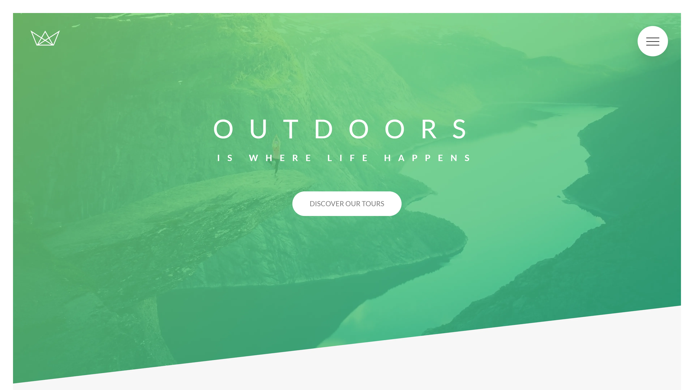

# Natours



You can view the project live here: <a href="https://natours-dusan.netlify.app" target="_blank">Natours</a>

## 📂 Table of Contents

- [Description](#-description)

- [Key Features](#-key-features)

- [Arhitecture](#-arhitecture)

- [Technologies Used](#-technologies-used)

- [Installations and Tests](#-installations-and-tests)

## 📝 Description

A company specialized in organizing and offering adventure tours for people who love nature. The site has modern animations, fluid design and optimal performance.

### 🔑 Key Features

- <b>Sass Mastery:</b> Learn the ins and outs of Sass, including variables, nesting, mixins, extends, and functions.

- <b>CSS Architecture:</b> Implement the 7-1 CSS architecture for better organization and maintainability.

- <b>BEM Methodology:</b> Embrace the Block Element Modifier methodology for clear and scalable class naming, fostering maintainable and modular code.

- <b>Responsive Design:</b> Understand the principles of responsive design and build custom grids for various sections.

- <b>Media Queries:</b> Desktop-first approaches, writing effective media queries with Sass mixins.

- <b>Responsive Images:</b> Handling responsive images in HTML and CSS.

- <b>Final Considerations:</b> Wrap up the Natours project with insights and best practices.

[Back To The Top](#natours)

### 🏛️ Arhitecture

```
sass/
|-- abstracts/
|   |-- _functions.scss
|   |-- _mixins.scss
|   |-- _variables.scss
|
|-- base/
|   |-- _animations.scss
|   |-- _base.scss
|   |-- _typography.scss
|   |-- _utilities.scss
|
|-- components/
|   |-- _bg-video.scss
|   |-- _button.scss
|   |-- _card.scss
|   |-- _composition.scss
|   |-- _featured-box.scss
|   |-- _form.scss
|   |-- _popup.scss
|   |-- _story.scss
|
|-- layout/
|   |-- _footer.scss
|   |-- _grid.scss
|   |-- _header.scss
|   |-- _navigation.scss
|
|-- pages/
|   |-- _home.scss
|
|-- main.scss
```

## 💾 Technologies Used

<p style="margin-left:18px;margin-top:30px;display:flex; gap:18px;">
    <a href="https://developer.mozilla.org/en-US/docs/Glossary/HTML5" target="_blank" rel="noreferrer">
        
    </a>
    <a href="https://www.w3.org/TR/CSS/#css" target="_blank" rel="noreferrer">
        
    </a>
    <a href="https://sass-lang.com/" target="_blank" rel="noreferrer">
        
    </a>
</p>

[Back To The Top](#natours)

## 💻 Installations and Tests

To install dependencies, run these commands

```
npm i
```

To run tests, run these commands

```
npm run start
```

## 📧 Questions

For additional questions, contact me at the email provided below.

- GitHub [Dusan Madjar](https://github.com/Djarma12)
- Email madjardusan@gmail.com

[Back To The Top](#natours)
